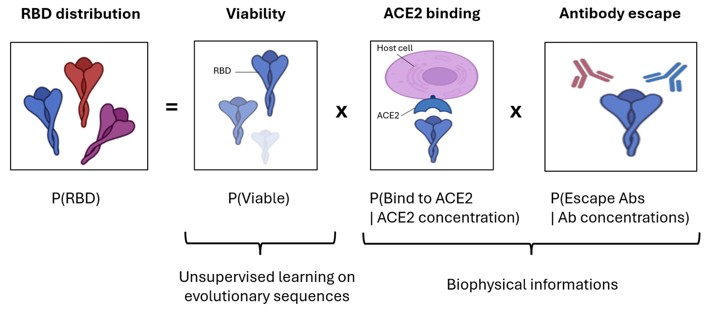

# ESCAPE_MAP_DRAFT

Probabilistic model to predict and design SARS‑CoV‑2 Spike RBD escaping antibodies. It combines:

- Antibody binding predictors
- ACE2 binding predictor
- A sequence prior from an RBM trained on natural prepandemic RBD sequences

## Data

Download and unzip the experimental data folder 'exp_data/' from [Zenodo](https://doi.org/10.5281/zenodo.17485261) and place it in the main directory. This is necessary to run the scripts.   

Raw pandemic data used in this study are available on [Zenodo](https://doi.org/10.5281/zenodo.17485261) but not necessary to run the scripts.

## Quick Start

Clone PGM repository (https://github.com/jertubiana/PGM) inside main folder.

To fit model on pandemic sequences in seq_data and create parameter file: run fit_model.py.

## License

This project is released under the MIT License. See `LICENSE` for details.

